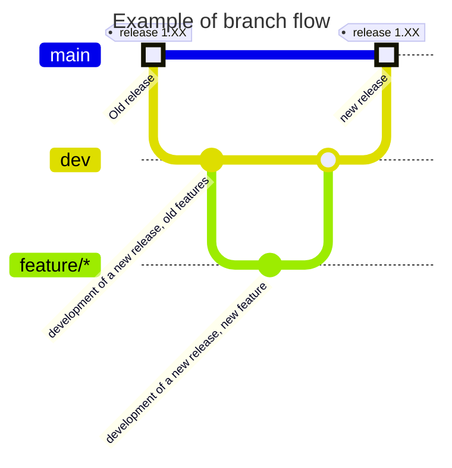

Not much to say: a bash script to make the installation "clean" for now!

```mermaid
---
title: Example of branch flow
---
gitGraph
   commit id: "Old release" type: HIGHLIGHT tag: "release 1.XX"
   branch dev
   checkout dev
   commit id: "development of a new release, old features"
   branch "feature/*"
   checkout "feature/*"
   commit id: "development of a new release, new feature"
   checkout dev
   merge "feature/*"
   checkout main
   merge dev id: "new release" type: HIGHLIGHT tag: "release 1.XX"
   
```
